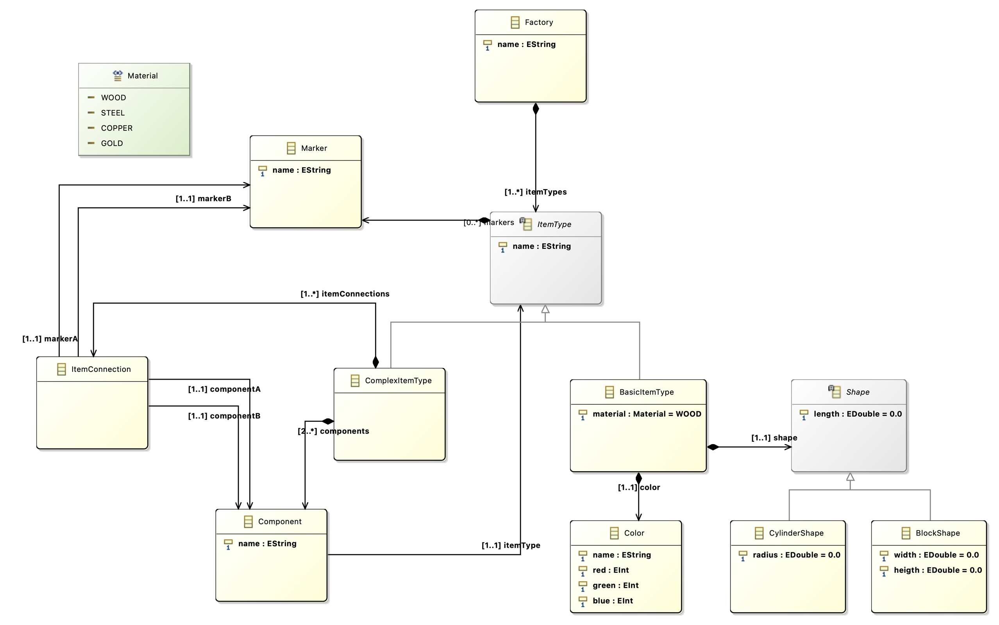

# lab2-tutorial-example
Lab2 tutorial examples as presented in the tutorial

This tutorial covers XText textual domain specific modeling language with a factory metamodel. The concepts covered in the tutorial are creating an XText Grammer for a [hammer factory metamodel](https://github.com/MEws22/lab2-tutorial-example/tree/main/tutorial) as given in Figure. 1.

<figure>

<figure-caption>Figure 1. Hammer Factory Metamodel</figure-caption>
</figure>

The [first metamodel](https://github.com/MEws22/lab2-tutorial-example/tree/main/tutorial) covers the concepts presented in the video tutorial [here](https://www.youtube.com/watch?v=EKpqPX5tcn0) 
